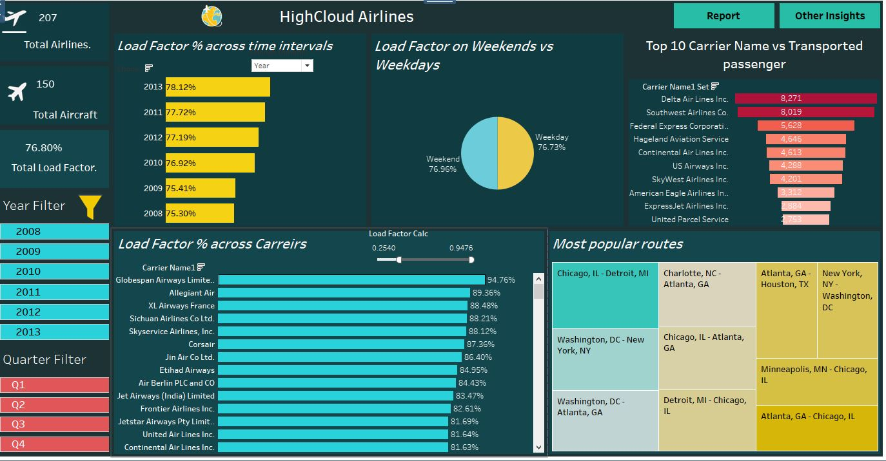
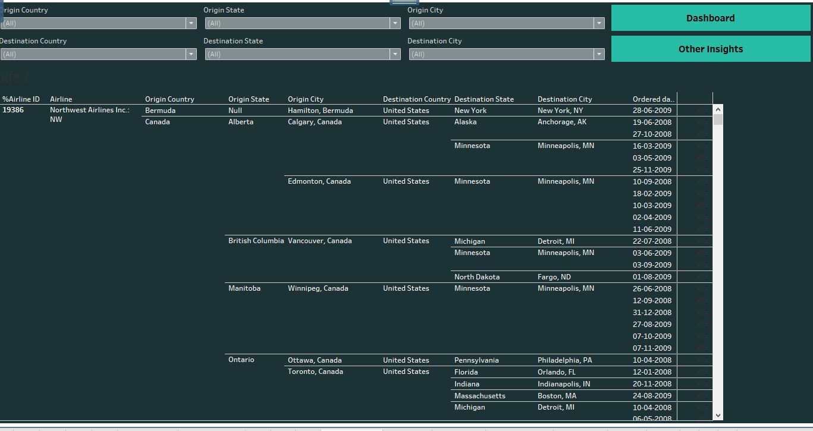
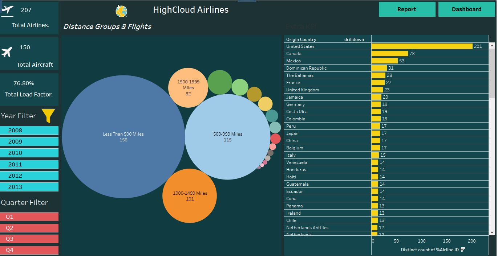

# HighCloud Airlines

<h1>Aim</h1>To identify the Load factors that the airline industry uses to gauge customer satisfaction.Cost Effective, Convenient for Customers 
<h1>Sources</h1>

<h4>To understand Load Factor of HighCloud Airlines , I have created Tableau dashborad, Power Bi and Excel </h4>
Link: [Tableau Project Link](https://public.tableau.com/app/profile/sneha.deolikar/viz/P305AirlinesDashboardbackup/Dashboard1?publish=yes)
<h1>Screenshot</h1>
  
    
    
<h1>Observation</h1>
<ol>
<li>Yearly Load factor observation, in 2013 its increasing ,2008 its decreasing and in 2010,2011,2012 its stable. Month wise July has highest load factor and quarter wise July, august, September i.e. Q3 increased the load factor. </li>
<li>Highest Load factor on carrier Globespan Airways with 94.76% </li>
<li> Carriers with consistently high load factors indicate effective capacity management and strong demand for their services</li>
<li> higher Load is observed on weekend due to seasonal vacation & weekday during rush hours when people commute to work or industrial and commercial activities</li>
<li> In Top Routes Chicago to Detroit has maximum number of flights departures i.e. 95 whereas 2nd top route is Washington to new York has 88 flights departures.</li>
<li> number of flights in each distance group can reveal the role of airports and airlines as hubs for connecting different regions. </li>
<li> Short-haul flights may have a higher frequency </li></ol>

<h1>Suggestion </h1>
<ul>
<li>Customer happiness is a critical indicator in every business</li>
<li>ensuring an efficient balance between demand and available capacity.</li>
<li>Allocate resources more effectively by focusing on routes and flights with consistently high load factors,</li>
<li>All factors are related with United States, This has to be improved.</li>
<li>Highest number of flights are flying for shortest Distance(Less than 500 miles) this has to be improved</li>
<li>Find ways to do things faster and better, especially on routes where a lot of people want to fly</li>
<li>Think about using different types of planes for short trips to make sure they're the most efficient and cost-effective</li>
<li>Collaborate with partner airlines or travel agencies based on load factor insights</li>
</ul>

<h1>What I Learnt</h1>
<ul>
  <li>Create Interactive dashborad</li>
  <li>Merge or Join Multiple Table </li>
  <li>Used Calculated field for formulas with various condition</li>
  <li>Used the Filters</li>
  <li>creating set</li>
  <li>Used Varies Charts pie chart,bubble chart,heat map</li>
  <li>Using dual axis create clustered chart</li>
</ul>

